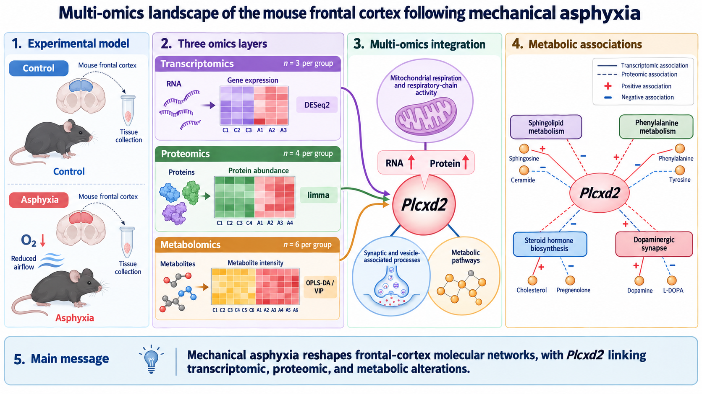

# Multi-Omics Analysis of Mechanical Asphyxia Effects on the Mouse Frontal Cortex



This repository contains transcriptomic, proteomic, and metabolomic data for investigating the effects of mechanical asphyxia on the mouse frontal cortex. The study groups are labeled `Control` and `Asphyxia`, and the frontal cortex is designated as region `R1` in the source data. Original sample identifiers retain the legacy `CON` prefix.

## Study Design

| Omics layer | Asphyxia | Control | Tissue |
|---|---:|---:|---|
| Transcriptomics | 3 | 3 | Frontal cortex (R1) |
| Proteomics | 4 | 4 | Frontal cortex (R1) |
| Metabolomics | 6 | 6 | Frontal cortex (R1), plus 3 QC samples |

Samples with the same group and replicate number originate from the same animal. For example, transcriptomic samples `CON_R1_1` and `Asphyxia_R1_1` correspond to subjects `CON-1` and `Asphyxia-1`, respectively.

- Complete three-omics pairing: three animals per group, `CON-1` through `CON-3` and `Asphyxia-1` through `Asphyxia-3`.
- Proteomics-metabolomics pairing: four animals per group, `CON-1` through `CON-4` and `Asphyxia-1` through `Asphyxia-4`.
- Metabolomics-only animals: `CON-5`, `CON-6`, `Asphyxia-5`, and `Asphyxia-6`.

## Repository Structure

```text
.
├── config/
│   └── samples.csv
├── data/
│   ├── transcriptomics/
│   ├── proteomics/
│   ├── metabolomics/
│   ├── metadata/
│   └── README.md
├── scripts/
└── results/
```

## Recommended Input Matrices

- Transcriptomic differential expression: `data/transcriptomics/frontal_cortex_gene_counts.csv`
- Transcriptomic visualization and multi-omics integration: `data/transcriptomics/frontal_cortex_vst_expression.csv`
- Proteomics: the processed expression-matrix worksheet in `data/proteomics/protein_expression_log2.xlsx`
- Metabolomics: the processed expression-matrix worksheet in `data/metabolomics/metabolite_expression.xlsx`

`all_regions_vst_expression.csv` contains transcriptomic samples from all four regions (R1-R4) and can be used for region-specific comparisons. Frontal-cortex multi-omics integration should use `frontal_cortex_vst_expression.csv`.

## Analysis Notes

- Use the raw transcriptomic count matrix for differential expression and VST
  expression for visualization and multi-omics integration.
- Large raw FASTQ, mass-spectrometry RAW, and tar archive files are intentionally excluded from this repository.
- Metadata retain both the original region code (`R1`) and the standardized region name (`frontal_cortex`).
- Chinese biological annotations and original worksheet names in vendor-provided data files are intentionally preserved.

See `data/README.md` for data provenance, worksheet details, and file checksums.

## Analysis Workflow

Run all commands from the repository root after activating the `zcz_env` Conda
environment. Each R script uses the project paths shown below by default and
writes results to the corresponding numbered directory under `results/`.

| Step | Analysis | Command | Main output directory |
|---:|---|---|---|
| 1 | Transcriptomic differential expression with DESeq2 | `Rscript scripts/01_transcriptomics_deseq2.R` | `results/01_transcriptomics/` |
| 2 | Proteomic differential expression with limma | `Rscript scripts/02_proteomics_limma.R` | `results/02_proteomics/` |
| 3 | Transcriptome-proteome integration and nine-quadrant analysis | `Rscript scripts/03_transcriptome_proteome_integration.R` | `results/03_transcriptome_proteome_integration/` |
| 4 | Plcxd2-centered transcriptome/proteome correlation GSEA | `Rscript scripts/04_plcxd2_correlation_gsea.R` | `results/04_plcxd2_correlation_gsea/` |
| 5 | Metabolomic OPLS-DA, permutation validation, and VIP analysis | `Rscript scripts/05_metabolomics_oplsda.R` | `results/05_metabolomics/` |
| 6 | Plcxd2-metabolomics pathway integration | `Rscript scripts/06_plcxd2_metabolomics_integration.R` | `results/06_plcxd2_metabolomics_integration/` |

The workflow progresses from single-omics differential analysis to
transcriptome-proteome integration, Plcxd2-centered pathway analysis,
metabolomic modeling, and final Plcxd2-pathway-metabolite integration. The
last step combines VIP pathway enrichment, ssGSEA pathway activity, matched-
animal correlations, and a three-layer network.

See `scripts/README.md` for detailed inputs, statistical thresholds, outputs,
and implementation notes.
